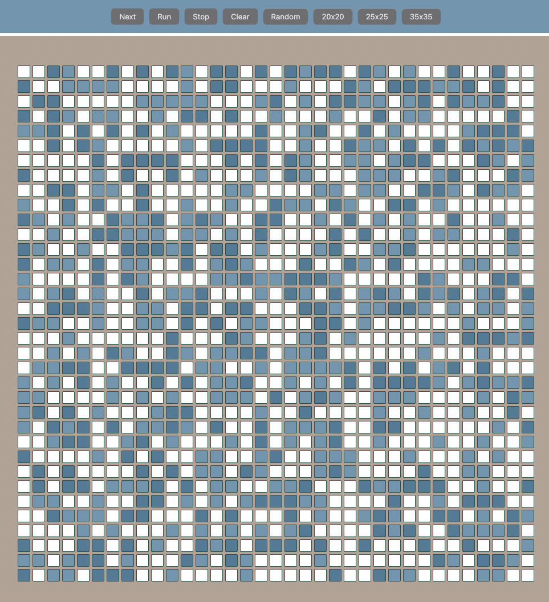

   
  <h1>Conway's Game of Life 🌱</h1>
  <strong>by OTUS</strong>

 

Добро пожаловать! 
Данный репозиторий - проектная работа по курсу от ОТУС [React.js Developer](https://otus.ru/learning/225406/)

## What is it?

Работа представляет собой веб версию игры Жизнь [Правила игры](https://en.wikipedia.org/wiki/Conway%27s_Game_of_Life)

## Table of Contents

- [What is it?](#what-is-it)
- [Table of Contents](#table-of-contents)
- [Rules and options](#rules-and-options)
- [Getting Started](#getting-started)
- [Core team](#core-team)
- [License](#license)

## Rules

Правила игры стандартные, без авторских доработок
Сам проект - страница с игрой
Какие есть настройки и опции:
- каждый элемент (box) кликабелен и может менять свое состояние по клику
- возможность управление игрой (старт, стоп)
- возможность случайного заполнения и очистки поля
- можно выбирать размер поля от 20 до 35 боксов

## Getting Started

Для запуска проекта потребуется `NodeJS` версии 16+

##### Developer

`npm run dev`

##### Test

`npm run test`

##### Storybook

`npm run storybook`

##### Chromatic

`npm run chromatic`

## Core team

- Developer [@DMisilin](https://github.com/DMisilin)
- Designer [@dmIsIlIn](https://github.com/DMisilin)
- Tester [@dmisiliN](https://github.com/DMisilin)
- Admin [@dm](https://github.com/DMisilin)

## License

По всем вопросам можно обращаться:
[license FAQ](https://smallbusiness.ru/uploads/library/big/8289d5e363ff408d9d3a74a0477b7cb03f5930f5.jpg)

 

  
   
  <strong>Живи достойно</strong> ❤️

[⬆ Back to Top](#Table-of-contents)
